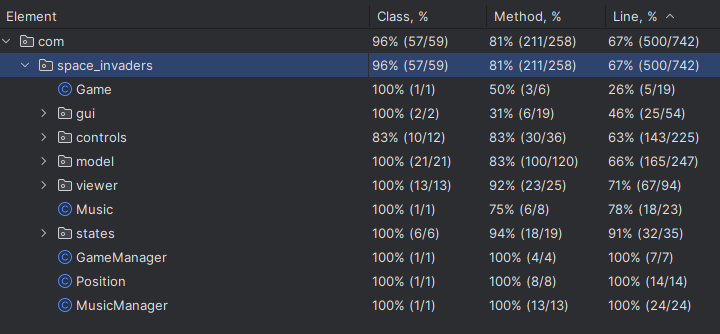
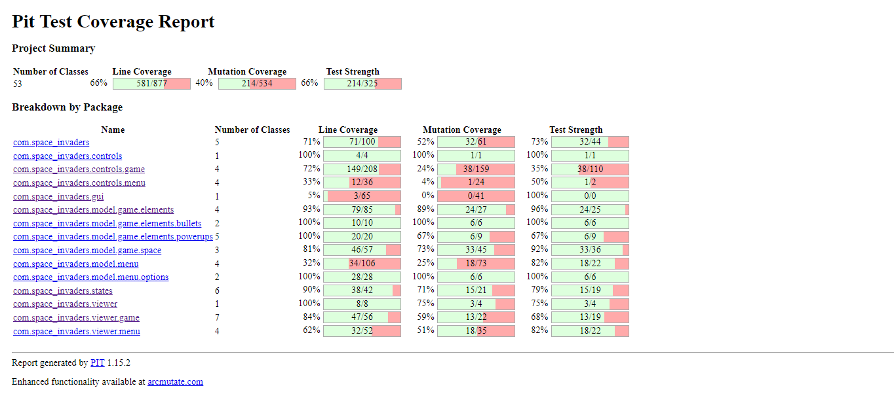

## LDTS_14_08 - Space Invaders

In this 2D fixed shooter game, the player controls a spaceship that shoots lasers!
The objective of the player is to fire at the aliens and survive. The game will be infinite giving a score in the end of the game.

This project was made and developed by Pedro Borges (up202207552@fe.up.pt), Alexandre Lopes (up202207015@fe.up.pt) and Tomás Linhares (up202207236@fe.up.pt) for LP01 2023/2024.

## IMPLEMENTED FEATURES 

- Menu - When the game is initialized a Menu is displayed (Player chooses between playing, seeing the controls and the game objective in the instructions, seeing the leaderboard or quitting).
- Movement - The spaceship can only move horizontally, and it's bounded to the screen limits.
- Shooting - The spaceship and the aliens can shoot, aliens shooting is random and only the last row can shoot.
- Power-Ups - There is a set of power-ups which can be picked up after destroying the PowerUpShip witch spawns after a certain amount of points (Faster fire rate, slower fire rate and extra life).
- Aliens - The aliens roam through the space and when they reach the screen limits they go down and change movement direction.
- SpaceShip Collisions - If the spaceship gets hit by an alien shot, its lives decrease by one, when they reach zero its game over, also if the aliens reach the spaceship its game over too,
if a spaceship shot hits an alien, they die and if they hit a PowerUpShip they drop a Power-Up.
- Borders of the Map - If an alien gets to the borders they go down and switch movement direction, if it's an PowerUpShip it disappears and if it's the spaceship it is unable to move further into that direction.
- Score - When the player destroys Aliens and PowerUpShips, he gains points.
- Lives - The player has an amount of lives, that decreases everytime he gets hit.
- Game Over - When the player runs out of lives or the Aliens reach the Player, the game ends.
- Instructions - A page that shows the basic controls for the game.
- Leaderboard - When the user loses, his score is saved to a file.
- SoundTrack - Play background music when user is playing.
- Sounds - Play sounds when the player or alien fires a shot, when aliens,PowerUpShips or the player gets hit, when the player gets a power-up, when the PowerUpShip is on the space roaming and when the player clears a wave of aliens.
- Increasing Difficulty - When the player finishes the horde of aliens the game increases difficulty and keeps the score of the player.

## PLANNED FEATURES 

- All features are implemented!

## DESIGN

Our UML for this project looks like this.

#### Strategy Pattern
##### Problem in Context
We were thinking of using a lot of conditional logic when deciding how would the spaceship behave while shooting, since shooting should be different based on which power-up (faster fire-rate,half fire-rate shooting, ). 
##### The Pattern
Instead, we will apply the Strategy pattern. Making it possible to distinguish what to do to the spaceship based on what power-ups the player has...
#### Implementation
Can be seen in the image of our UML 
#### Consequences
The use of the Strategy Pattern in the current design allows the following benefits:

- It provides a way to extract the behavior of an object into separate classes that can be swapped in and out at runtime. This enables the object to be more flexible and reusable, as different strategies can be easily added or modified without changing the object's core code.
- We don’t need to have a long set of conditional if or switch statements associated with the various states; instead, polymorphism is used to activate the right behavior.
- There are now more classes and instances to manage.

#### MVC Pattern
##### Problem in Context
We noticed the code looked a bit messy, and it would be hard for other people to read it and understand it.
##### The Pattern
So we decided that we will use this pattern to separate the game logic from the display code, this makes the code more readable and easier to fix.
##### Implementation
Can be seen in the image of our UML
##### Consequences
The use of the MVC Pattern in the current design allows the following benefits:

- It's easier to add features and to fix bugs.
- The code will be more organised, so it's easier to read and to write.

#### State Pattern 
##### Problem in Context
We decided to use the State Pattern to distinguish the different states of the Game (InstructionMenuState, EndScreenState, GameState, LeaderBoardState, MainMenuState)
##### Implementation
Can be seen in the image of our UML
##### The Pattern/Consequences
The use of the State Pattern in the current design allows the following benefits:

- The state design pattern improves readability, and hence maintainability, by representing each state in a separate class.
- Complexity The state design pattern significantly decreases complexity of monolithic classes that rely on switch/case or if/else statements to change runtime state.

#### Singleton
##### Problem in Context 
We wanted to implement music and sounds to the elements of our game
##### Implementation
Can be seen in the image of our UML
##### The Pattern/Consequences
The use of the Observer Pattern in the current design allows the following benefits:

- Each time we need to access the MusicManager class we can simply get an instance of the object, so there is no need to pass it as an attribute to all the classes that use it.
- We can be sure that a class has only a single instance.

#### Factory Pattern
##### Problem in Context

We noticed the entities of our game had some similarities, but it wouldn't do us any better having a common interface because it wouldn't be reusable, classes that implement such interface have different atributes and types, so instead of having them separated
and when needed to change a common attribute having to change all the classes, we decided it was best to use this Pattern.

##### The Pattern
This Factory pattern defines an interface for creating objects, but lets subclasses decide which classes to instantiate.

##### Implementation
Can be seen in the image of our UML
##### Consequences 
The use of the Factory Pattern in the current design allows the following benefits:
- Factory methods eliminate the need to bind application-specific classes into your code.
- The code only needs to deal with the Product interface; therefore it can work with any user-defined ConcreteProduct classes. 
#### KNOWN CODE SMELLS 

We didn't notice any code smells.

### TESTING

### SELF-EVALUATION

Pedro Borges - 37,5%

Alexandre Lopes - 37,5%

Tomás Linhares - 25%

### Sources

Althought we made the project fully by ourselves, we took inspiration in "hero-solid" by André Restivo and we looked at Asteroids project made by Afonso Baldo, João Teixeira and José Gaspar for the Music implementation.